> **About this repository**
>
> FinGuard AI is our **Final Year Project**. The complete application source code is in our **private repository**: [**github.com/Rana-Hassan7272/finguard**](https://github.com/Rana-Hassan7272/finguard) — we keep it private to protect implementation details.
>
> **This public repository** is the documentation and showcase mirror: system architecture, deployment guides, ML benchmarks, evidence artifacts, and app screenshots — everything needed to understand what we built and shipped, without exposing the full codebase.

---

<div align="center">

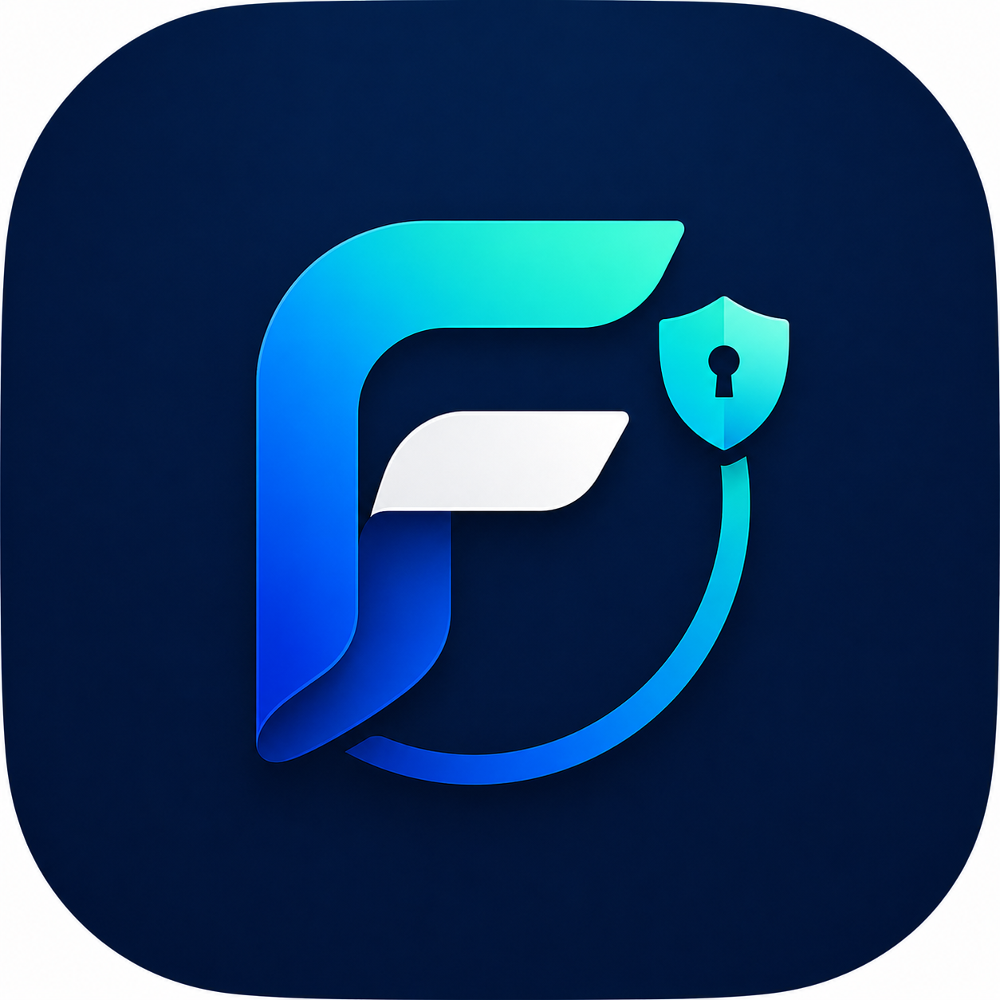

# FinGuard AI

**Pakistani personal finance, fully automated.**

SMS · Bank Notifications · Gmail · OCR/PDF · Manual Entry → 22-category ledger → Finni AI Advisor

[](https://finguard-production-0a3c.up.railway.app/health)
[](https://tinyurl.com/ai-powered-finguard)
[](#architecture)
[](#ml--intelligence)

| Resource | Link |
|---|---|
| 🚀 Production API | `https://finguard-production-0a3c.up.railway.app` |
| ❤️ Health Check | `GET /health` |
| 📱 Android APK | [Download APK](https://tinyurl.com/ai-powered-finguard) |
| 🚢 Deploy Runbook | [`deployment.md`](deployment.md) |
| 📊 ML Benchmarks | [`evidence/MLFLOW_METRICS.md`](evidence/MLFLOW_METRICS.md) |

</div>

---

## Table of Contents

1. [What Ships](#1-what-ships)
2. [Full System Architecture](#2-full-system-architecture)
3. [Data Ingestion](#3-data-ingestion)
4. [ETL Pipeline](#4-etl-pipeline)
5. [Database](#5-database)
6. [Parsing & Pakistani Banks](#6-parsing--pakistani-banks)
7. [Merchant Intelligence](#7-merchant-intelligence)
8. [Accounts & Wallets](#8-accounts--wallets)
9. [Core Product Features](#9-core-product-features)
10. [Finni — AI Advisor](#10-finni--ai-advisor)
11. [Mobile App](#11-mobile-app)
12. [Engagement & Push Automation](#12-engagement--push-automation)
13. [ML & Intelligence](#13-ml--intelligence)
14. [Scheduled Jobs & CI](#14-scheduled-jobs--ci)
15. [Deployment & Ops](#15-deployment--ops)
16. [Local Development](#16-local-development)

---

## 1. What Ships

### ✅ Live in Production (June 2026)

| Area | Shipped |
|---|---|
| **Capture** | Live SMS, bulk inbox, bank notifications, Gmail sync, OCR/PDF, offline queue |
| **Categorization** | 7-layer `MerchantNormalizer` — MCC · GPS Places · knowledge graph · rules/LLM · user feedback · taxonomy keywords · BERT fallback; 22-category ledger; corrections teach `merchant_user_patterns` + KG |
| **Money** | Per-wallet ledgers (6 PK wallets + Cash), verify-balance anchor, repair-ledgers |
| **Predictions** | LSTM spend forecasting — next-month estimate, 3-month outlook, peak category/month; tiered fallback for new users; Analytics Predictions tab |
| **Budgets** | 22-category limits, 90%/100% push warnings, Finni cut suggestions |
| **Goals** | Savings goals + Goal Coach, weekly nudges, salary-triggered contributions |
| **Investments** | Holdings, events, Finni Investment Planner, Shariah keyword screening |
| **Zakat** | Live PK gold rates, Nisab/Hawl tracking, 2.5% breakdown, payment records |
| **Fraud** | Isolation Forest real-time scoring, push alerts, in-app resolution |
| **Finni AI** | Multi-agent SSE chat, RAG, router LLM, 11 intents, Goal Coach + Planner cards |
| **Analytics** | **Spending DNA** — anonymous peer mix (budget-share % vs population median); **Weekly AI recap** — Gemini summary from real stats only |
| **Automation** | Celery Beat — daily Gmail sync, goal/bill/balance/merchant pushes |
| **Quality** | Parser golden harness, pytest CI, Great Expectations ETL, admin dashboard |

### ⏸ Intentional Deferrals

| Item | When to Enable |
|---|---|
| Airflow (18 DAGs) | Central batch UI, heavier ML windows |
| `apps/web` admin | Host for ops team (runs locally today) |
| iOS app | Separate EAS + native modules |
| Budgets / Investments / Zakat tabs | Unhide in `_layout.tsx` |

### App Preview

<table>
  <tr>
    <td align="center">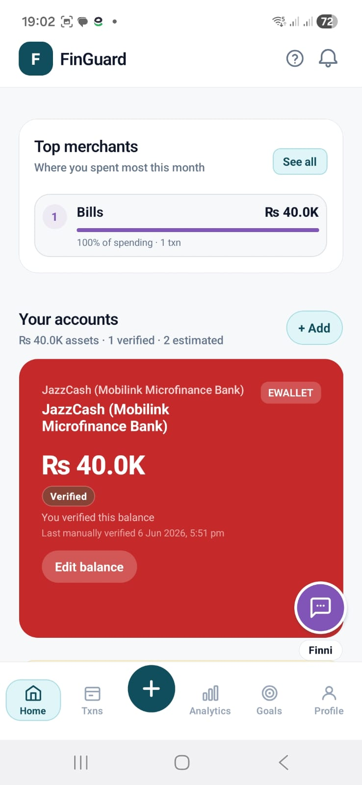<br/><sub>Home — accounts</sub></td>
    <td align="center">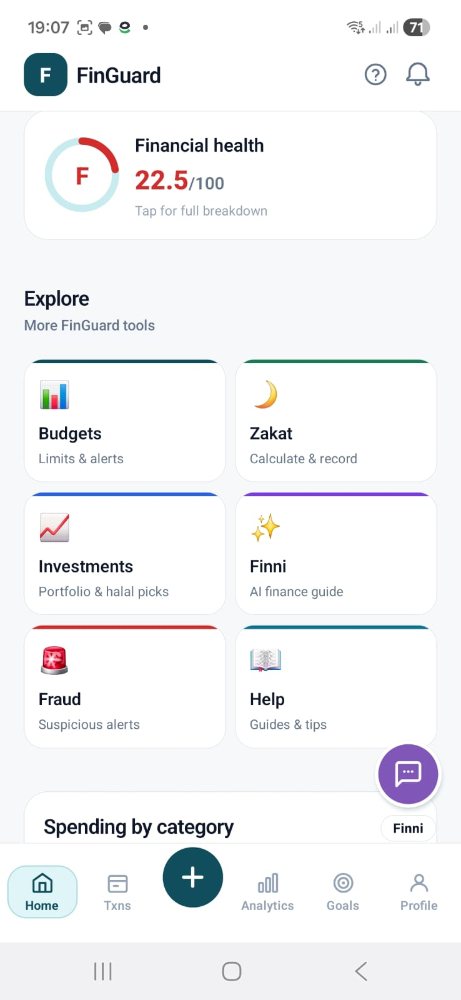<br/><sub>Home — explore and health</sub></td>
    <td align="center">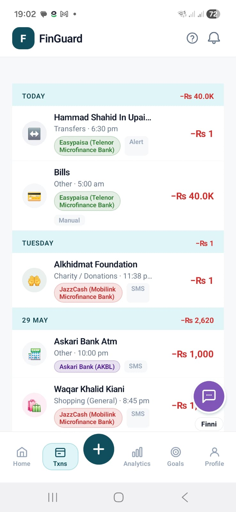<br/><sub>Transactions — SMS and alerts</sub></td>
    <td align="center">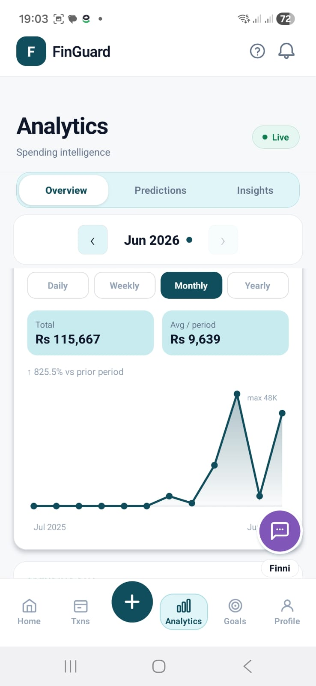<br/><sub>Analytics — spending trends</sub></td>
  </tr>
  <tr>
    <td align="center">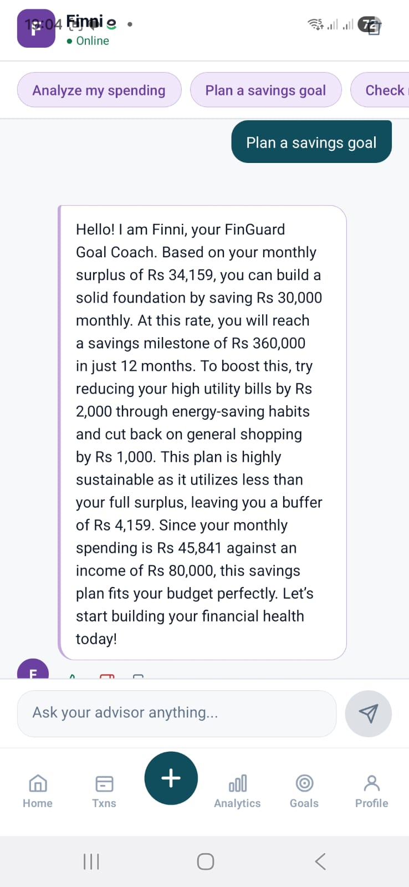<br/><sub>Finni — Goal Coach</sub></td>
    <td align="center">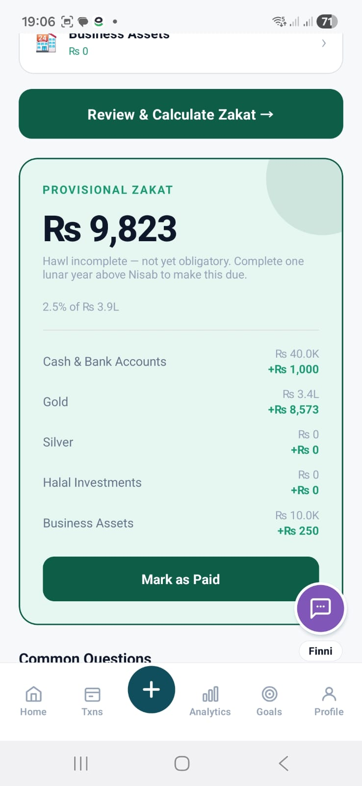<br/><sub>Zakat — 2.5% breakdown</sub></td>
    <td align="center">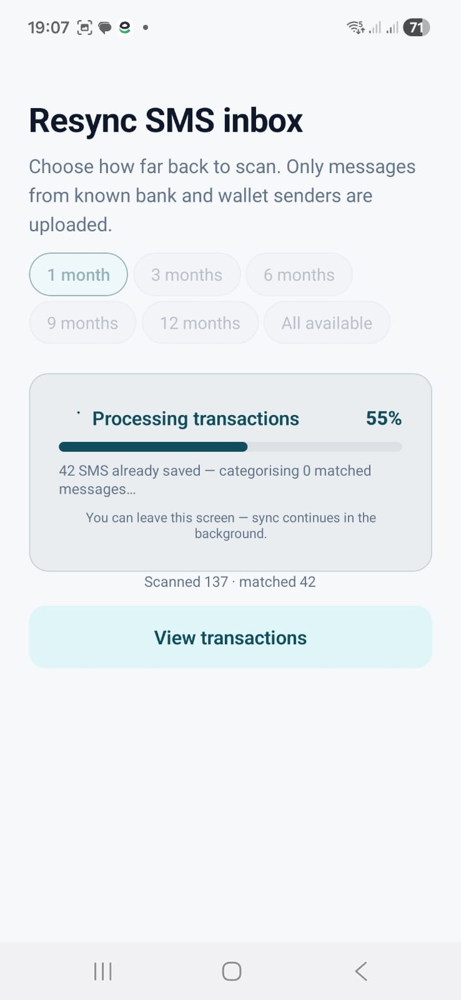<br/><sub>SMS — bulk inbox resync</sub></td>
    <td align="center">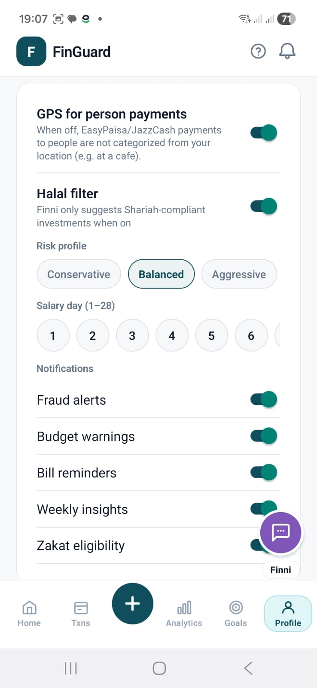<br/><sub>Profile — GPS halal risk alerts</sub></td>
  </tr>
</table>

---

## 2. Full System Architecture

### 2.1 End-to-End System

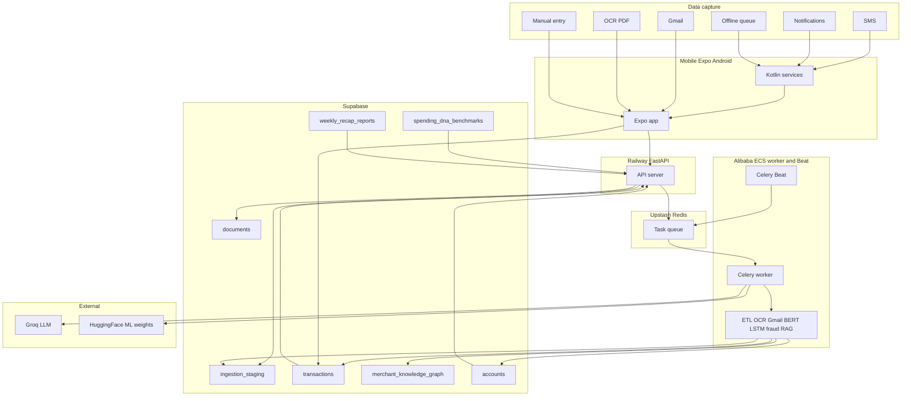
```mermaid
flowchart TB
  subgraph ingestCh ["Data capture"]
    CapSms["SMS"]
    CapNotif["Notifications"]
    CapGmail["Gmail"]
    CapOcr["OCR PDF"]
    CapManual["Manual entry"]
    CapOffline["Offline queue"]
  end

  subgraph mobileCh ["Mobile Expo Android"]
    ExpoCh["Expo app"]
    NativeCh["Kotlin services"]
    NativeCh --> ExpoCh
  end

  subgraph railwayCh ["Railway FastAPI"]
    ApiCh["API server"]
  end

  subgraph redisCh ["Upstash Redis"]
    RedisCh["Task queue"]
  end

  subgraph ecsCh ["Alibaba ECS worker and Beat"]
    WorkerCh["Celery worker"]
    BeatCh["Celery Beat"]
    EtlCh["ETL OCR Gmail BERT LSTM fraud RAG"]
    WorkerCh --> EtlCh
  end

  subgraph supaCh ["Supabase"]
    StageCh["ingestion_staging"]
    TxnCh["transactions"]
    KgCh["merchant_knowledge_graph"]
    DocCh["documents"]
    AcctCh["accounts"]
    DnaCh["spending_dna_benchmarks"]
    RecapCh["weekly_recap_reports"]
  end

  subgraph extCh ["External"]
    GroqCh["Groq LLM"]
    HfCh["HuggingFace ML weights"]
  end

  CapSms --> NativeCh
  CapNotif --> NativeCh
  CapOffline --> NativeCh
  CapGmail --> ExpoCh
  CapOcr --> ExpoCh
  CapManual --> ExpoCh

  ExpoCh --> ApiCh
  ApiCh --> StageCh
  ApiCh --> DocCh
  ApiCh --> RedisCh

  RedisCh --> WorkerCh
  BeatCh --> RedisCh

  EtlCh --> TxnCh
  EtlCh --> KgCh
  EtlCh --> StageCh
  EtlCh --> AcctCh

  WorkerCh --> GroqCh
  WorkerCh --> HfCh

  TxnCh --> ApiCh
  AcctCh --> ApiCh
  DnaCh --> ApiCh
  RecapCh --> ApiCh
  ExpoCh --> TxnCh
```

> Worker ETL includes 7-layer `MerchantNormalizer` (MCC → GPS → KG → rules → feedback → keywords → BERT) before writing `transactions` and `merchant_knowledge_graph`.

### 2.2 ETL Data Flow

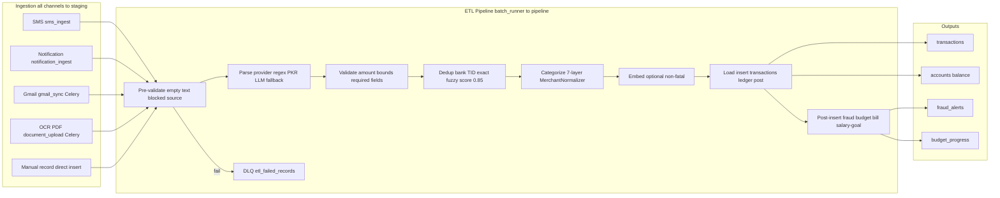
```mermaid
flowchart LR
  subgraph ingest ["Ingestion all channels to staging"]
    S1["SMS sms_ingest"]
    S2["Notification notification_ingest"]
    S3["Gmail gmail_sync Celery"]
    S4["OCR PDF document_upload Celery"]
    S5["Manual record direct insert"]
  end

  subgraph etl ["ETL Pipeline batch_runner to pipeline"]
    PRE["Pre-validate empty text blocked source"]
    PARSE["Parse provider regex PKR LLM fallback"]
    VALID["Validate amount bounds required fields"]
    DEDUP["Dedup bank TID exact fuzzy score 0.85"]
    CAT["Categorize 7-layer MerchantNormalizer"]
    EMBED["Embed optional non-fatal"]
    LOAD["Load insert transactions ledger post"]
    POST["Post-insert fraud budget bill salary-goal"]
    DLQ["DLQ etl_failed_records"]
  end

  subgraph outputs ["Outputs"]
    TXN["transactions"]
    WALLET["accounts balance"]
    FRAUD_T["fraud_alerts"]
    BUDGET["budget_progress"]
  end

  S1 --> PRE
  S2 --> PRE
  S3 --> PRE
  S4 --> PRE
  S5 --> PRE
  PRE -->|fail| DLQ
  PRE --> PARSE --> VALID --> DEDUP --> CAT --> EMBED --> LOAD --> POST
  LOAD --> TXN
  LOAD --> WALLET
  POST --> FRAUD_T
  POST --> BUDGET
```

### 2.3 Deduplication Strategy

Same payment arrives via SMS + Notification + Gmail + OCR simultaneously. Two layers prevent double-counting:

**Layer 1 — Staging:** `unique(user_id, source, source_message_id)` — identical message never queued twice.

**Layer 2 — Transaction fuzzy dedup:**

| Path | Mechanism | Threshold |
|---|---|---|
| Fast (bank TID) | `external_ref_id = bank_tid:{id}` unique per user | Exact → skip |
| Fuzzy | Amount 40% + time window 30% + direction 20% + merchant 10% | Score ≥ 0.85 |

**Source priority when deduped** (higher wins):

```
notification (5) > sms (4) > gmail (3) > ocr (2) > voice (1) > manual (0)
```

**Fuzzy time windows:**

| Source | Look-back |
|---|---|
| notification / sms | 5 min |
| gmail | 1 hr |
| ocr / pdf / statement | 72 hrs |
| manual | 24 hrs |

<p align="center">
  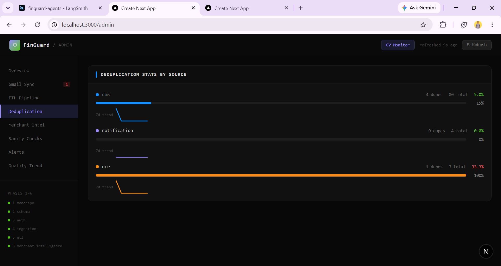
  <br/><sub>Admin dashboard — deduplication stats by SMS, notification, and OCR</sub>
</p>

### 2.4 Production Topology

```
Android APK ──HTTPS──► Railway FastAPI (role: api)
     │                        │
     │ Supabase JWT            │ Celery enqueue
     ▼                        ▼
Supabase ◄──────────── Upstash Redis (/0 only)
     ▲                        │
     │ read/write              │ consume
     └────────────── Alibaba ECS (worker + Beat)
                               ├── ETL · Gmail · OCR · BERT
                               └── HF model sync (hassan7272/finguard-ml)
```

> **Rule:** Mobile talks only to Railway API + Supabase — never Alibaba directly.

| Surface | URL / Host |
|---|---|
| API | `https://finguard-production-0a3c.up.railway.app` |
| Database / Auth | Supabase (Postgres + Auth + Storage) |
| Task Queue | Upstash Redis `rediss://…/0` |
| Background Jobs | Alibaba ECS Singapore |
| ML Weights | Hugging Face `hassan7272/finguard-ml` |

---

## 3. Data Ingestion

All channels write to `ingestion_staging` first with an `idempotency_key` (`msg:{source_message_id}` or SHA256 content hash). Duplicate inserts are silently skipped.

| Channel | API Route | ETL Trigger |
|---|---|---|
| SMS (live) | `POST /api/v1/sms/ingest` | Auto inline |
| SMS (bulk) | `POST /api/v1/sms/ingest/bulk` | Celery + `task_progress` |
| Bank notifications | `POST /api/v1/notifications/ingest` | Auto inline |
| Gmail | `POST /api/v1/gmail/sync` | Celery `etl.gmail_sync` |
| Manual entry | `POST /api/v1/transactions/record` | Immediate insert |
| OCR / PDF | `POST /api/v1/documents/upload` | Celery `cv.process_document` |
| Offline queue | `POST /api/v1/mobile/sync-offline-queue` | Same as live ingest |

### SMS Pre-filters

1. `is_financial_sms_sender(sender_id)` — PK bank/wallet short-code whitelist
2. `should_stage_sms()` — drops promos, balance-only, non-transaction boilerplate

### Gmail Sync Windows

- First sync: last 90 days (`GMAIL_BOOTSTRAP_DAYS`)
- Subsequent: since user's salary day in current/previous month, with **48h overlap** on `last_synced_at` so boundary emails are not missed
- Auto-sync: Celery Beat every 24 h
- Query: finance keywords + PDF attachments; excludes `-category:promotions` and `-category:social`
- Pre-filter on metadata (supported bank sender only); skip message IDs already in `ingestion_staging`
- Batch-fetch bodies 100/call; commit staging every 50 emails; list up to 1000 messages (paginated)
- **PDF + body:** statement attachments are parsed **and** the email body is still parsed for alert transactions

**Supported Gmail ingest (6 only):** JazzCash · EasyPaisa · Allied/ABL · Askari · Meezan · UBL  
NayaPay, SadaPay, HBL, and other providers are ignored until added later.

**Key backend modules:** `backend/etl/gmail_sync_config.py` · `backend/etl/gmail_connector.py` · `backend/etl/tasks/gmail_tasks.py`

### GPS Spend Context

P2P payments near a shop/café hold categorization pending user confirmation via `POST /api/v1/transactions/{id}/location-context`. Disable per user with `users.disable_gps_for_p2p`.

<p align="center">
  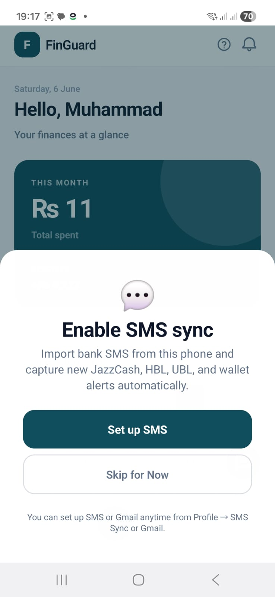
  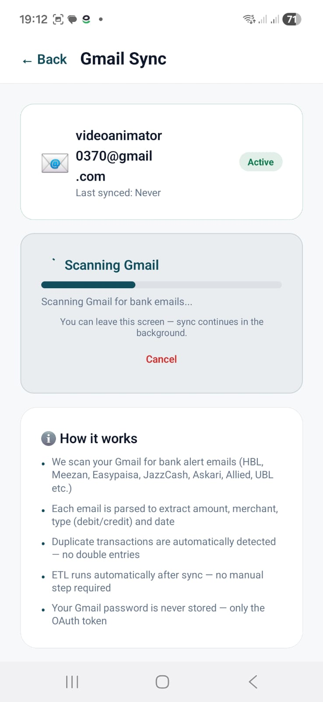
  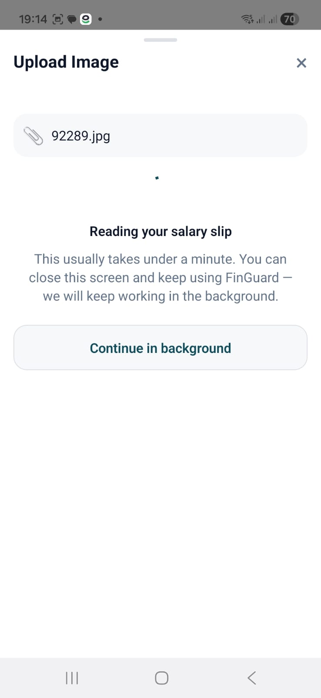
  <br/><sub>SMS onboarding · Gmail sync · OCR salary slip upload</sub>
</p>

---

## 4. ETL Pipeline

**Core:** `backend/etl/pipeline.py` (`ETLPipeline`)  
**Batch runner:** `backend/etl/batch_runner.py` → Celery `etl.process_pending_batch`  
**DLQ:** `etl_failed_records` via `make_supabase_dlq_writer`  
**Data quality:** Great Expectations snapshots → `etl_quality_snapshots`

### Processing Stages

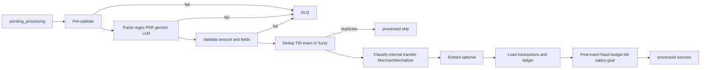
```mermaid
flowchart LR
  A["pending_processing"] --> B["Pre-validate"]
  B -->|fail| DLQ
  B --> C["Parse regex PKR generic LLM"]
  C -->|fail| DLQ
  C --> D["Validate amount and fields"]
  D -->|fail| DLQ
  D --> E["Dedup TID exact or fuzzy"]
  E -->|duplicate| DONE_D["processed skip"]
  E --> F["Classify internal transfer MerchantNormalizer"]
  F --> G["Embed optional"]
  G --> H["Load transactions and ledger"]
  H --> I["Post-insert fraud budget bill salary-goal"]
  I --> DONE["processed success"]
```

### OCR/PDF Ledger Rules

- New rows: `skips_balance_ledger = true`, `is_verified_by_user = false`
- Hidden from Home, net worth, and budget spend until confirmed
- Auto-confirm if `confidence_score ≥ 0.82` + category set + amount in bounds
- Manual confirm → `PATCH is_verified_by_user: true` → ledger applies
- Discard → `DELETE`

### Operational Knobs

| Variable | Purpose |
|---|---|
| `ETL_MAX_WORKERS` | Parallel staging rows per batch (use `1` on Windows) |
| `ETL_SYNC_ON_MOBILE_INGEST` | Inline ETL when no worker |
| `FINGUARD_DISABLE_ANOMALY_SCORING=1` | Skip fraud ML (CI / local) |
| `POST /api/v1/etl/process-pending` | Manual batch trigger |

---

## 5. Database

**Migrations:** `supabase/migrations/` (50+ files). Apply all pending migrations newest-last on every deploy.

**Auth:** `auth.users` is source of truth. `public.users.user_id` FK → `auth.users(id)`.

**Access:** Mobile/API uses user JWT (RLS enforced). ETL/workers use `get_supabase_admin_client()` service role.

### Key Tables

**`transactions`** — canonical ledger (all amounts in paisa)

| Column | Purpose |
|---|---|
| `source` | `gmail` / `sms` / `notification` / `manual` / `ocr` / `pdf` |
| `external_ref_id` | Dedup key — unique per user |
| `merchant_canonical` | Normalized merchant name |
| `category`, `subcategory` | 22-category taxonomy |
| `categorization_layer` | 1–7 (which ML layer resolved it) |
| `confidence_score` | 0–1 |
| `skips_balance_ledger` | Self-transfer / pre-anchor / unverified OCR |
| `is_verified_by_user` | OCR/PDF confirm flag |
| `is_fraud_flagged` | ETL anomaly score |

**`accounts`** — per-wallet state

| Column | Purpose |
|---|---|
| `balance_state` | `unknown` / `estimated` / `verified` |
| `manually_verified_at` | Balance anchor — ledger deltas applied after this |
| `last_balance_confirmed_at` | Drift nudge timer |
| `dismissed_by_user` | ETL must not recreate dismissed providers |

**`ingestion_staging`** — ETL queue (`pending_processing` → `processed` / `failed`)

### Notable Migrations

| Migration | Adds |
|---|---|
| `20260517_balance_accuracy.sql` | `external_ref_id`, account month stats trigger |
| `20260528_per_account_balance_ledger.sql` | `skips_balance_ledger`, `balance_state`, per-account ledger |
| `20260529_account_balance_adjustments.sql` | `manually_verified_at`, adjustments table |
| `20260531_spend_context_gps.sql` | P2P GPS columns |
| `20260513_phase9_rag_kb_schema.sql` | Full RAG schema |
| `20260605_goal_nudges_ocr_ledger.sql` | `notify_goal_nudges`, OCR ledger backfill |
| `20260607_engagement_automation_wave2.sql` | Bill reminders, merchant_key, paid tracking |

---

## 6. Parsing & Pakistani Banks

**Orchestration:** `backend/etl/parsers/text_parser.py`  
**Provider registry:** `backend/etl/parsers/patterns/provider_registry.py`  
**Gmail fast parsers:** `backend/etl/parsers/email_finance_parser.py` (Easypaisa, ABL, JazzCash)  
**Gmail/PDF AI fallback:** `backend/etl/parsers/ai_email_extractor.py` · `backend/etl/documents/ai_statement_parser.py`

### Parse Flow

```
Input text + sender/package/domain
    │
    ├─► Resolve provider (sender ID / email domain / PDF profile) — 6 banks for Gmail ingest
    ├─► Provider-specific regex (SMS, Gmail patterns, PDF profiles)
    ├─► Gmail dedicated parsers (Easypaisa / ABL / JazzCash email bodies)
    ├─► Generic PKR/direction patterns
    └─► LLM fallback (Gemini for Gmail + PDF statements; Groq/OpenRouter for other paths)
```

### Home Ledger Providers

| Provider | SMS Sender | Gmail Domain |
|---|---|---|
| JazzCash | `8558` | `jazzcash.com.pk`, `mobilinkbank.com.pk` |
| EasyPaisa | `3737` | `easypaisa.com.pk`, `telenorbank.pk` |
| Allied / myABL | ABL senders | `abl.com` |
| Askari | `AKBL` | `askaribank.com.pk` |
| Meezan | Meezan senders | `meezanbank.com` |
| UBL | UBL senders | `ubl.com.pk` |

> Gmail sync ingests **only** the six providers above. HBL, MCB, Alfalah, NayaPay, SadaPay, etc. are parsed on other channels where applicable but are **not** pulled from Gmail.

### Parser Evaluation (2026-06-06) — 91.1% overall (214/235)

| Provider × Channel | Pass Rate | Samples |
|---|---|---|
| JazzCash SMS | 100% | 18/18 |
| EasyPaisa PDF | 100% | 30/30 |
| Allied PDF | 100% | 19/19 |
| Allied SMS | 100% | 5/5 |
| Askari SMS | 100% | 7/7 |
| Askari Notification | 100% | 3/3 |
| Askari PDF | 94.3% | 50/53 |
| UBL PDF | 100% | 9/9 |
| UBL Gmail | 100% | 2/2 |
| Meezan SMS | 100% | 2/2 |
| HBL SMS | 100% | 3/3 |
| HBL PDF | 88.9% | 8/9 |
| EasyPaisa Gmail | 71.4% | 5/7 |
| EasyPaisa SMS | 100% | 1/1 |

```bash
# Reproduce
python evaluation/ingestion/provider_pattern_eval.py --json -o evidence/parser_eval_full.json
```

---

## 7. Merchant Intelligence

Every debit/credit passes through `MerchantNormalizer` (`backend/etl/merchant/normalizer.py`).

**Self-transfer detection** (`backend/etl/merchant/internal_transfer.py`): own-account moves when merchant/counterparty matches profile name, same sender+receiver in one alert, or paired opposite legs — excluded from spend/income totals (`transfers/self_transfer`); International Remittance and external salary channels are not misclassified.

**22 categories:** `food_dining` · `grocery` · `utilities` · `mobile_internet` · `transport_fuel` · `travel` · `entertainment` · `health_fitness` · `social_events` · `shopping_general` · `clothing_footwear` · `electronics_gadgets` · `healthcare_pharmacy` · `education` · `cash_withdrawal` · `transfers` · `income_salary` · `bills_government` · `investments` · `charity_donations` · `subscriptions` · `other`

### 7-Layer Decision Engine

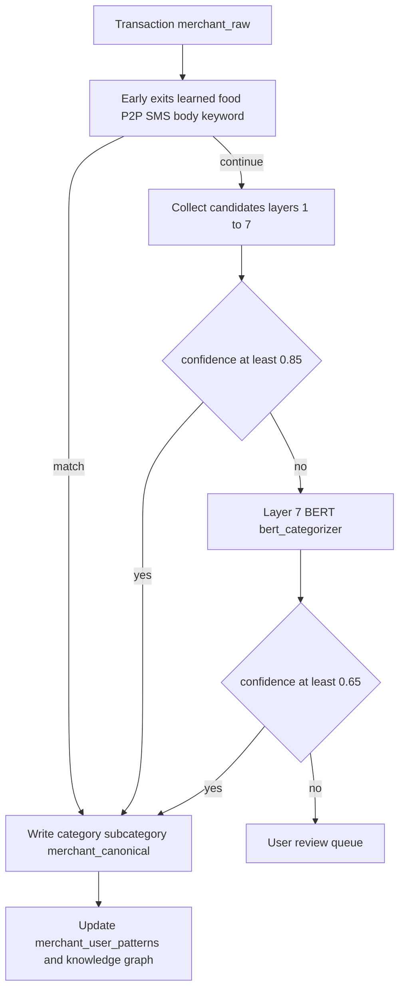
```mermaid
flowchart TB
  IN["Transaction merchant_raw"]
  EARLY["Early exits learned food P2P SMS body keyword"]
  COLLECT["Collect candidates layers 1 to 7"]
  HI{"confidence at least 0.85"}
  BERT["Layer 7 BERT bert_categorizer"]
  LO{"confidence at least 0.65"}
  OUT["Write category subcategory merchant_canonical"]
  REVIEW["User review queue"]
  LEARN["Update merchant_user_patterns and knowledge graph"]

  IN --> EARLY
  EARLY -->|match| OUT
  EARLY -->|continue| COLLECT
  COLLECT --> HI
  HI -->|yes| OUT
  HI -->|no| BERT
  BERT --> LO
  LO -->|yes| OUT
  LO -->|no| REVIEW
  OUT --> LEARN
```

### User Learning Loop

| Action | Effect |
|---|---|
| User changes category | Updates row → `merchant_user_patterns` |
| Confirm GPS venue | Applies suggested category + teaches payee |
| Confirm feedback | Promotes to `merchant_knowledge_graph` |
| Next same payee | `resolve_user_learned` runs before all layers |

---

## 8. Accounts & Wallets

**Core:** `backend/api/services/account_balance_engine.py`

### Balance States

| State | Meaning |
|---|---|
| `unknown` | New account, no anchor set |
| `estimated` | In/out tracked from messages; no user anchor |
| `verified` | User entered real balance; `manually_verified_at` set |

> All six Home providers require a manual balance anchor. SMS `balance_after` lines do **not** auto-verify.

### Key Endpoints

| Endpoint | Purpose |
|---|---|
| `POST /api/v1/accounts/{id}/verify-balance` | Set balance anchor |
| `POST /api/v1/accounts/{id}/recalculate-balance` | Replay txns from anchor |
| `POST /api/v1/accounts/repair-ledgers` | Merge duplicates, relink, rebuild |
| `GET /api/v1/accounts/stats` | Net worth, month in/out, emergency fund |
| `POST /api/v1/accounts/{id}/confirm-balance` | Reset 7-day drift timer |

### Balance Drift Nudge

Verified wallet not re-confirmed in 7 days → `needs_balance_drift_check = true` → weekly push → in-app `AccountBalanceCard` prompt.

---

## 9. Core Product Features

### Budgets

22-category monthly limits. `GET /api/v1/budgets/progress` returns `spent`, `limit`, `percent_used`, `is_exceeded` for all categories. Push alerts fire at ≥90% (Finni cut-suggestions) and 100%+ (overrun).

<p align="center">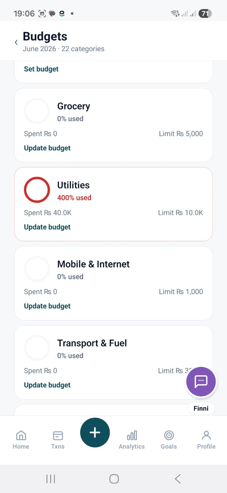<br/><sub>Budget progress with overrun alerts</sub></p>

### Savings Goals

| Field | Detail |
|---|---|
| Types | `house` · `car` · `wedding` · `hajj` · `emergency_fund` · `education` · `retirement` · `custom` |
| Metrics | `percent_complete`, `track_status` (`on_track` / `slightly_behind` / `behind`) |
| Goal Coach | Finni SSE card → `goal_proposal` → save; `deduct_mode`: `skip` / `account` / `net_balance` |

<p align="center">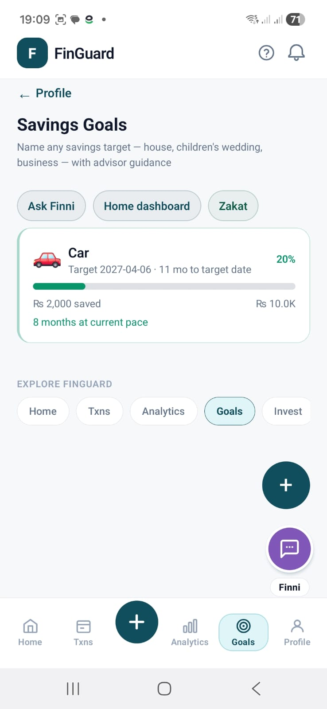<br/><sub>Savings goal progress with Finni guidance</sub></p>

### Investments

Holdings: gold, plot, mutual funds, sukuk, stocks, vehicle. Events: `top_up`, `withdrawal`, `valuation`. Investment Planner blocked when emergency fund < 3 months. Shariah keyword screening on name/institution.

### Zakat

| Endpoint | Purpose |
|---|---|
| `GET /api/v1/zakat/assets` | Zakatable assets, Nisab, Hawl status |
| `GET /api/v1/zakat/gold-price?refresh=1` | Live PK metal rates (15-min cache) |
| `GET/POST /api/v1/zakat/calculate` | 2.5% breakdown |
| `GET/POST /api/v1/zakat/records` | History + mark paid |

Uses live wallet balances from ledger engine, not stale `accounts.balance_paisa`.

<p align="center">
  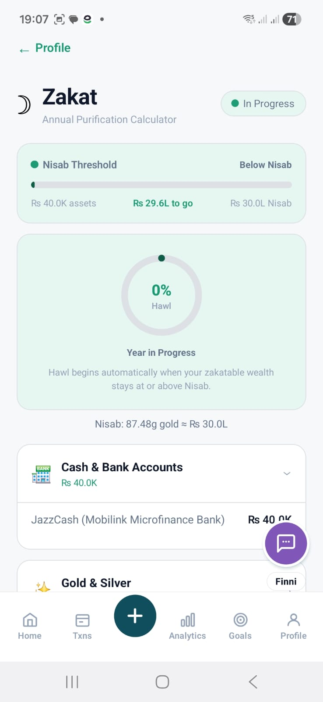
  
  <br/><sub>Nisab and Hawl tracker · provisional Zakat breakdown</sub>
</p>

### Fraud & Security

Real-time Isolation Forest scoring at ETL. Supabase Realtime subscription on `fraud_alerts` drives mobile push.

| Endpoint | Purpose |
|---|---|
| `GET /api/v1/fraud-alerts` | Inbox + `unresolved_count` |
| `POST /api/v1/fraud-alerts/{id}/resolve` | `false_positive` / `confirmed_fraud` |

<p align="center">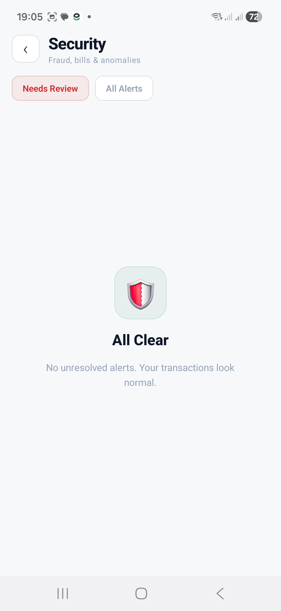<br/><sub>Fraud and anomaly inbox — all clear state</sub></p>

### Financial Health Score

Six components (0–100): savings rate · budget adherence · emergency fund months · Zakat compliance · halal investment ratio · bill discipline → **grade A+–F**

### Bills & Subscriptions

Auto-detected from SMS/Gmail (K-Electric, PTCL, school fees, streaming). Push reminders 3 and 2 days before due. Matching debit auto-marks bill paid.

### LSTM Spending Predictions

| Tier | Gate |
|---|---|
| Tier 3 LSTM | ≥ 3 calendar months debit history |
| Tier 2 | Weighted monthly average (1–5 months) |
| Tier 1 | Demographic baseline (new users) |

<p align="center">
  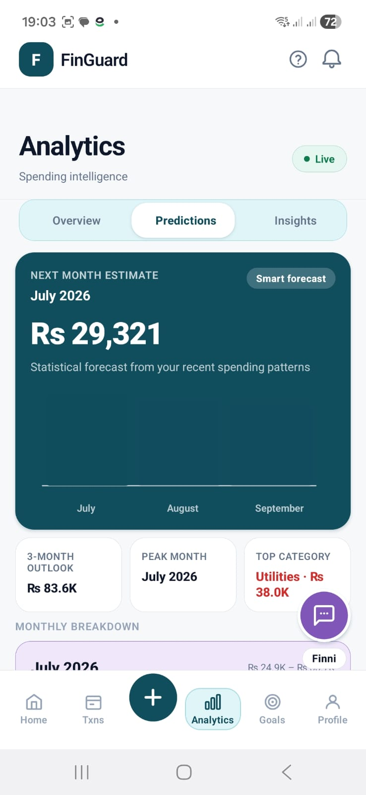
  
  <br/><sub>LSTM next-month estimate · monthly spending chart</sub>
</p>

### Spending DNA (peer benchmarking)

Compare your **spending mix** to anonymized FinGuard users — not raw rupee totals (so higher income does not automatically show “+100% on everything”).

| Piece | Detail |
|---|---|
| **Where** | Analytics tab → **Spending DNA** panel |
| **API** | `GET /api/v1/analytics/spending-dna` (always HTTP 200; cold-start JSON when pool is small) |
| **Compare mode** | **Budget share %** per category (your category ÷ your month spend vs population median share) |
| **Privacy** | K-anonymity: `MIN_POPULATION_USERS=25`, `MIN_CATEGORY_CONTRIBUTORS=12`; no names or account numbers in the pool |
| **Seed data** | Optional `SPENDING_DNA_EXCLUDE_SEED=1` omits `SEED_DNA` demo rows from the pool (production) |
| **Refresh** | Nightly Airflow task + `POST /api/v1/analytics/spending-dna/refresh`; stale after 6h |
| **Dev seed** | `python scripts/seed_dna_population.py --users 50 --refresh` then `python scripts/refresh_spending_dna.py` |

**UI:** blue bar = your share of monthly spend in that category; gray bar = typical user’s median share; delta is capped for readability (±80% to +120%).

<p align="center">
  
  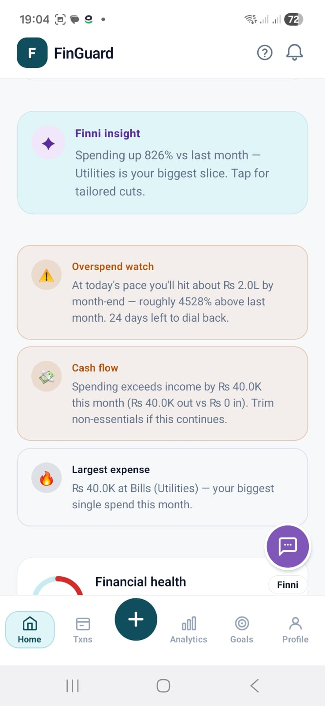
  <br/><sub>Spending DNA peer mix · Home insight cards</sub>
</p>

### Weekly AI recap

AI-generated **Monday–Sunday** money summary from **pre-computed stats only** (no invented transactions).

| Piece | Detail |
|---|---|
| **Where** | Analytics tab → **Weekly recap** card (above insights) |
| **API** | `GET /api/v1/analytics/weekly-recap/status` · `POST …/generate` · `GET …/current` |
| **Model** | Gemini (`gemini-3.1-flash-lite`) via `backend/api/services/weekly_recap.py` |
| **Sections** | Week at a glance · Top categories · One win · One watch-out · Budget pulse · Your next step |
| **Gates** | ≥14 days history, ≥2 debit months, ≥5 debits in the reporting week; **one report per `week_key`** |
| **Share** | In-app **View report** + system share sheet (Markdown stripped for readability) |

Unlock message shows until eligibility is met; **Generate** runs once per week to control LLM cost.

---

## 10. Finni — AI Advisor

**API:** `POST /api/v1/advisor/chat` (SSE stream)

### Routing

| Path | When | Handler |
|---|---|---|
| `direct` | Small talk / greetings | `_get_direct_reply` — no DB/RAG |
| `rag_only` | Islamic finance, tax, FBR, halal rules | `call_rag` → grounded response |
| `agent` (fast) | Balance / spending summary | `advisor_fast` — DB only, no LLM (~100–500 ms) |
| `agent` | Budgets, goals, investments, Zakat calc, fraud, health | `run_supervisor` → specialist agent |
| `clarify` | Ambiguous intent | One short question |

<p align="center">
  
  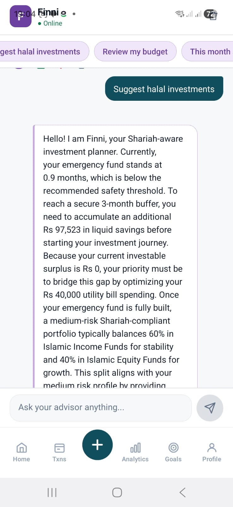
  <br/><sub>Goal Coach savings plan · Shariah-aware investment planner</sub>
</p>

### Multi-Agent Architecture (11 Intents → 9 Runners)

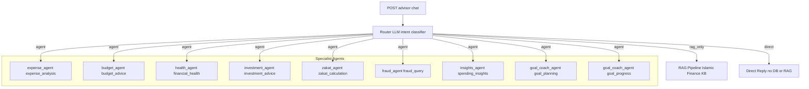
```mermaid
flowchart TB
  CHAT["POST advisor chat"]
  ROUTER["Router LLM intent classifier"]

  subgraph agents ["Specialist Agents"]
    A1["expense_agent expense_analysis"]
    A2["budget_agent budget_advice"]
    A3["health_agent financial_health"]
    A4["investment_agent investment_advice"]
    A5["zakat_agent zakat_calculation"]
    A6["fraud_agent fraud_query"]
    A7["insights_agent spending_insights"]
    A8["goal_coach_agent goal_planning"]
    A9["goal_coach_agent goal_progress"]
  end

  RAG["RAG Pipeline Islamic Finance KB"]
  DIRECT["Direct Reply no DB or RAG"]

  CHAT --> ROUTER
  ROUTER -->|agent| A1
  ROUTER -->|agent| A2
  ROUTER -->|agent| A3
  ROUTER -->|agent| A4
  ROUTER -->|agent| A5
  ROUTER -->|agent| A6
  ROUTER -->|agent| A7
  ROUTER -->|agent| A8
  ROUTER -->|agent| A9
  ROUTER -->|rag_only| RAG
  ROUTER -->|direct| DIRECT
```

### SSE Stream Events

| Event | Meaning |
|---|---|
| `[ROUTING]{...}` | Immediate heartbeat — prevents Android timeout |
| `[PING]` | Keepalive every 5 s |
| `[META]{...}` | Session, `run_id`, `sources[]`, structured cards |
| word chunks | Streamed response text |
| `[DONE]` | End of stream |

### RAG Architecture

**Pipeline:** Category filter → Self-RAG CP1 → Hybrid search (BM25 + dense + RRF) → User spending memory → Relevance filter + compress → LLM answer → Web fallback (Tavily / DuckDuckGo)

**Fast mode (default on):** `RAG_FAST_MODE=1` skips corrective retrieval rounds, LLM grounding regen, and retrieval-memory reads/writes; uses smaller hybrid top-k and query-embed LRU cache. `ADVISOR_FAST_MODE=1` routes balance/spending questions through `backend/agents/advisor_fast.py` (DB templates + 120 s cache) instead of the full LangGraph supervisor.

| Env | Default | Effect |
|---|---|---|
| `RAG_FAST_MODE` | `1` | Single hybrid pass, no grounding regen, embed cache 256 |
| `ADVISOR_FAST_MODE` | `1` | Balance/spending fast path before supervisor |
| `ADVISOR_FAST_CACHE_TTL_SECONDS` | `120` | TTL for fast agent answers |
| `RAG_CORRECTIVE_MAX_ROUNDS` | `0` when fast | Extra hybrid passes (set `1` to restore) |
| `RAG_GROUNDING_MAX_REGENERATIONS` | `0` when fast | LLM regen on grounding fail |
| `RAG_EMBED_QUERY_CACHE_SIZE` | `256` when fast | In-memory query embedding LRU |

**KB:** 102 documents · 16,474 parent chunks · 69,490 child chunks

**RAG A/B/C Evaluation (40 questions):**

| Config | Pipeline | Cosine | Latency |
|---|---|---|---|
| A | Dense vector only | 0.6155 | 9,154 ms |
| B | Hybrid BM25 + dense (RRF) | 0.6628 | 9,090 ms |
| **C (prod)** | **Full pipeline** | **0.6609** | **14,881 ms** |
| **Fast (prod default)** | **Hybrid + CP1 heuristics, no corrective/grounding loop** | — | **Target ~3–8 s KB / &lt;1 s fast agent** |

### Latency benchmark

Unit tests (no live API):

```bash
python -m pytest backend/tests/test_rag_fast_latency.py -q --tb=short
```

End-to-end p50/p95/p99 per Finni path (API must be running):

```bash
uvicorn backend.api.main:app --host 127.0.0.1 --port 8000
```

```bash
python evaluation/finni_latency_bench.py --host http://127.0.0.1:8000 --user-id YOUR_USER_UUID -n 10 --warmup 1
python evaluation/finni_latency_bench.py --host http://127.0.0.1:8000 --user-id YOUR_USER_UUID --scenario rag_kb -n 20
python evaluation/finni_latency_bench.py --mode local --user-id YOUR_USER_UUID --scenario fast_balance -n 20
```

Artifacts: `evidence/finni_latency_bench.txt` and `.json`. Single-scenario RAG smoke: `python evaluation/advisor_latency_smoke.py -n 10`.

---

## 11. Mobile App

**Stack:** Expo SDK 52 · Expo Router · TanStack Query · Zustand · Supabase Auth

### Navigation

```
Tabs (visible):   Home | Transactions | Add (+) | Analytics | Goals | Profile
Hidden tabs:      advisor | zakat | budgets | investments
Stack routes:     fraud | gmail-sync | sms-sync | goal/[goalId] | help
FAB (all tabs):   FinniFab → /(tabs)/advisor
```

### Onboarding (5 Steps)

| Step | Collects |
|---|---|
| 1 · Income | `monthly_income_paisa` |
| 2 · Salary day | `salary_day` (Gmail sync window) |
| 3 · Banks | `connected_providers[]` |
| 4 · Risk | `risk_profile` |
| 5 · Goals | `primary_financial_goals[]`, `halal_only_recommendations` |

<p align="center">
  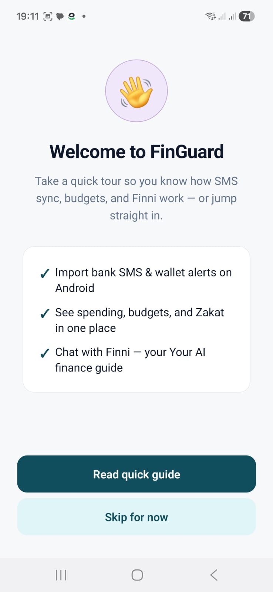
  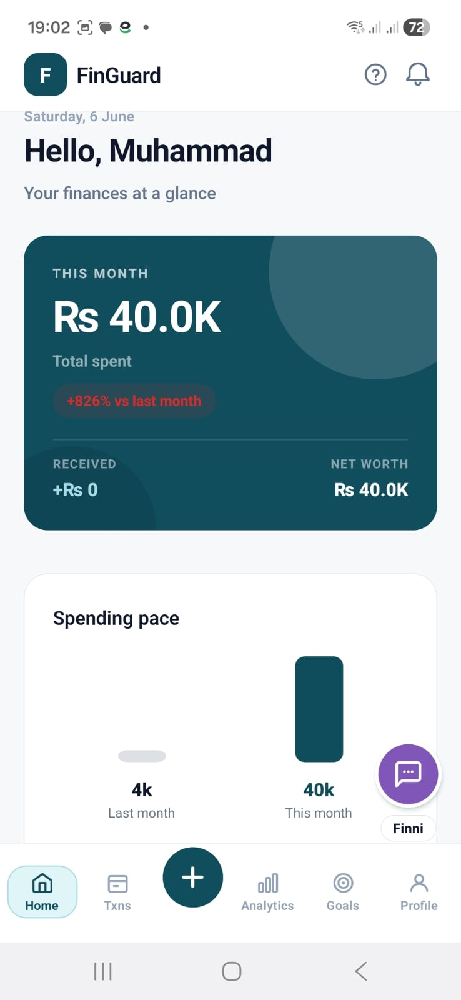
  <br/><sub>Welcome tour · monthly spend and net worth hero</sub>
</p>

### Home Dashboard Blocks

| Block | Component | Data |
|---|---|---|
| Spent hero + MoM badge | `HomePulseHero` | `/accounts/stats` |
| This vs last month bars | `HomeSpendCompareChart` | `last_month_outflow_paisa` |
| Health grade compact | `HomeHealthScoreCompact` | `/health-score/current` |
| Explore grid | `HomeExploreGrid` | Budgets · Zakat · Investments · Finni · Fraud |
| Account cards | `HomeAccountsSection` | Per-wallet balances + Edit balance |
| Budget alert pills | ≥ 80% threshold | `/budgets/progress` |
| Bills | `BillCard` | `/bills` |
| Recent transactions | 3 rows | `exclude_pending_review=true` |

### Analytics Tab

| Block | Component | Data |
|---|---|---|
| Spending DNA | `SpendingDnaPanel` | `GET /api/v1/analytics/spending-dna` — you vs anonymous pool (share %) |
| Weekly AI recap | `WeeklyRecapCard` | `weekly-recap/status` · user taps **Generate** once per week |
| Spending trends | `SpendingTrendsPanel` | Daily / weekly / monthly charts |
| LSTM forecast | Predictions section | Tiered next-month estimate |

### Android Kotlin Background Services

| Module | Role |
|---|---|
| `FinGuardSmsReceiver` | Live SMS → ingest API |
| `FinGuardNotificationListener` | Bank app notifications |
| `FinGuardForegroundService` | Background reliability |
| `FinGuardLocationCapture` | GPS on outflows |
| `FinGuardBackgroundUploader` | Batched upload |

---

## 12. Engagement & Push Automation

All scheduled pushes run via Celery Beat on Alibaba ECS. Requires `expo_push_token` on user row.

### Beat Schedule

| Task | Interval | What it does |
|---|---|---|
| `etl.dispatch_scheduled_gmail_sync` | 24 h | Auto Gmail sync for users due |
| `engagement.send_weekly_goal_nudges` | 7 d | Worst-behind goal → Finni deep link |
| `engagement.send_weekly_balance_drift_nudges` | 7 d | "Balance still correct?" push |
| `engagement.send_bill_reminder_pushes` | 24 h | Bills due in 3 or 2 days |
| `engagement.send_monthly_merchant_cleanup_nudges` | ~28 d | ≥ 5 uncategorized merchants |
| `etl.promote_staging_failures_to_golden` | 24 h | DLQ → parser golden samples |

### Push Deep Links

| Push Type | Opens |
|---|---|
| `goal_nudge` | Advisor + `goal_id` preset |
| `fraud_alert` | `/fraud` + action buttons |
| `budget_finni` | Advisor + cut-spending preset |
| `salary_goal` | Advisor + contribute preset |
| `balance_drift` | Home + `account_id` |
| `merchant_cleanup` | Home `openCleanup=1` → swipe sheet |
| `bill_reminder` | Home scroll to bills |

---

## 13. ML & Intelligence

| Component | Location | Role |
|---|---|---|
| BERT categorization | `backend/ml/bert/` | Layer 7 ETL — `bert_txn_production` on worker |
| LSTM predictions | `backend/ml/lstm/` | Analytics + `lstm_tool` + Beat weekly job |
| Isolation Forest | `backend/ml/anomaly/` | ETL `ScoringJob` → `fraud_alerts` |
| RAG | `backend/rag/` | Finni `rag_only` + `rag_tool` in agents |
| Spending DNA | `backend/api/services/spending_dna.py` | Anonymous category medians → Analytics peer compare |
| Weekly recap | `backend/api/services/weekly_recap.py` | Gemini narrative from aggregated week stats |
| Multi-agent | `backend/agents/` | Finni SSE advisor |

**Artifacts:** Private HF repo `hassan7272/finguard-ml` — synced on worker start (`FINGUARD_SYNC_ML_ON_START=1`).

### Benchmark Summary

| Model | Metric | Result |
|---|---|---|
| BERT | Weighted F1 | 88.74% |
| BERT | Accuracy | 89.26% |
| LSTM | Mean MAE (normalized) | 0.264 |
| LSTM | Categories MAE < 25% | 20/21 |
| Fraud (Isolation Forest) | F1 | 88.72% |
| Fraud | Average Precision | 95.13% |
| Agent harness | Scenarios passed | 5/5 |
| Parser golden | Overall pass rate | 91.1% (214/235) |

```bash
# Reproduce benchmarks
python evaluation/ingestion/provider_pattern_eval.py --json -o evidence/parser_eval_full.json
python backend/agents/tools/test_harness.py <user_uuid>
python -m backend.rag.evaluation.run_ragas --config all --limit 40 --output-dir evidence/rag_eval
python -m backend.ml.anomaly.run_pipeline eval
```

<p align="center">
  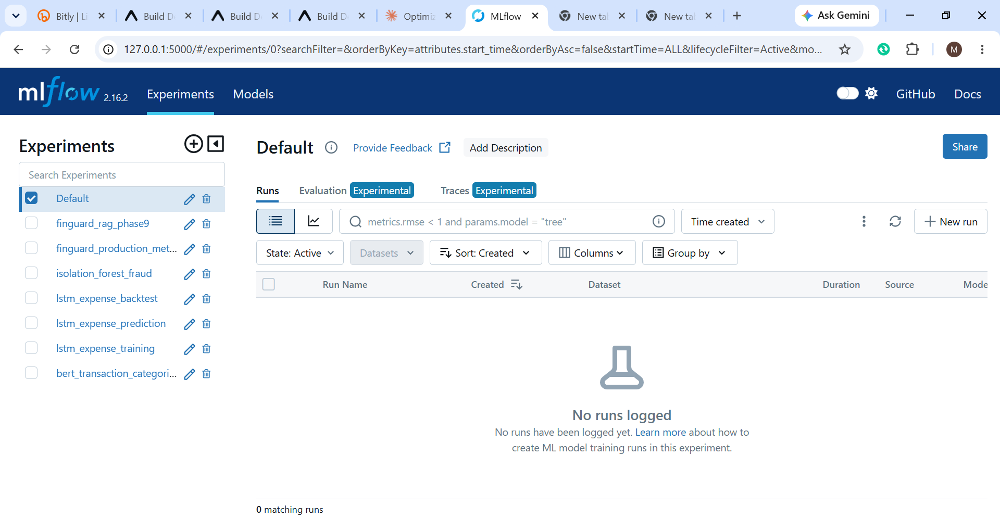
  
  <br/><sub>MLflow experiment registry · BERT categorization run (val F1 88.7%)</sub>
</p>

<p align="center">
  
  
  
  <br/><sub>LSTM expense · Isolation Forest fraud · RAG phase-9 eval runs</sub>
</p>

---

## 14. Scheduled Jobs & CI

### Celery Beat (Production)

Run exactly **one Beat instance** alongside the worker:

```bash
docker run -d --name finguard-beat --restart unless-stopped --env-file .env finguard-worker \
  celery -A backend.etl.worker_app beat --loglevel=info
```

### Airflow DAGs (Implemented — Available to Deploy)

18 DAG files in `infrastructure/airflow/dags/`. Celery Beat covers all current production needs. Deploy Airflow when a central ops UI or heavier batch windows are required.

| DAG | Celery Beat Equivalent |
|---|---|
| `gmail_sync_dag` (daily 03:00) | `daily-gmail-sync` |
| `transaction_processing_dag` (5 min) | Ingest triggers |
| `bert_weekly_retrain_dag` (Sun 02:00) | GitHub Actions `weekly-maintenance.yml` |
| `lstm_weekly_predictions_dag` (Sun 00:00) | On-demand / API |

### GitHub Actions (CI Gates)

| Workflow | Trigger | Purpose |
|---|---|---|
| `ci.yml` | Push/PR to `main` | Full pytest + parser eval JSON artifact |
| `weekly-maintenance.yml` | Sun 03:00 UTC | BERT correction gate + ML metrics |
| `rag-phase9-smoke.yml` | Push/PR | RAG smoke (`FINGUARD_RAG_MOCK=1`) |
| `phase6-quality-gate.yml` | PR + manual | Lint, typecheck, migration checks |

---

## 15. Deployment & Ops

Full runbook: [`deployment.md`](deployment.md)

### Platform Map

| Platform | What runs |
|---|---|
| Railway | FastAPI — auto-deploy from `main` |
| Alibaba ECS | Celery worker + Beat — manual Docker |
| Upstash | Redis broker + result backend + cache |
| Supabase | Postgres, Auth, Storage |
| Expo EAS | Android preview APK |
| Hugging Face | Private ML weights |

### Required Environment Variables

**API + Worker (both):**

| Variable | Purpose |
|---|---|
| `SUPABASE_URL` | Project URL |
| `SUPABASE_SERVICE_ROLE_KEY` | Staging, ETL, admin writes |
| `SUPABASE_JWT_SECRET` | Verify mobile JWT |
| `REDIS_URL` | Cache / rate limit |
| `CELERY_BROKER_URL` | `rediss://…/0?ssl_cert_reqs=CERT_REQUIRED` |
| `CELERY_RESULT_BACKEND` | Same Upstash `/0` |
| `GROQ_API_KEY` | Advisor router, parsers, RAG LLM |
| `GOOGLE_OAUTH_CLIENT_ID` | Gmail OAuth |
| `GOOGLE_OAUTH_CLIENT_SECRET` | Gmail OAuth |
| `FINGUARD_SERVICE_ROLE` | `api` on Railway / `worker` on ECS |

**Worker only (Alibaba ECS):**

| Variable | Value |
|---|---|
| `HF_TOKEN` | Read private HF repo (no quotes in `.env`) |
| `HF_ML_REPO_ID` | `hassan7272/finguard-ml` |
| `ML_ARTIFACTS_SOURCE` | `hf` |
| `FINGUARD_SYNC_ML_ON_START` | `1` |
| `FINGUARD_DEFER_PREWARM` | `1` |

**Optional:**

| Variable | When needed |
|---|---|
| `GOOGLE_API_KEY` or `GEMINI_API_KEY` | Gmail + PDF statement AI parse fallback (Gemini) |
| `GMAIL_AI_EMAIL_FALLBACK` | Set `false` to disable Gemini email extract (default: on) |
| `STATEMENT_AI_CHUNK_PARSER` | Set `false` to disable AI chunk parsing for PDF statements (default: on) |
| `RAG_FAST_MODE` | Set `0` to restore full RAG corrective + grounding loop (default: `1`) |
| `ADVISOR_FAST_MODE` | Set `0` to force balance/spending through full supervisor (default: `1`) |
| `OPENROUTER_API_KEY` | Secondary LLM / advisor routes |
| `TAVILY_API_KEY` | RAG web search |
| `EXPO_PUSH_ACCESS_TOKEN` | Expo push notifications |
| `LANGCHAIN_API_KEY` | LangSmith agent traces |
| `FINGUARD_DISABLE_ANOMALY_SCORING=1` | CI / local without fraud model |
| `FINGUARD_RAG_MOCK=1` | CI — RAG smoke without live embeddings |

> ⚠️ Railway must **not** run the Celery worker, use Railway internal Redis, or sync ML at boot.

### Deploy Checklist

| Step | Action | Verify |
|---|---|---|
| 1. Database | Apply `supabase/migrations/*.sql` newest-last | Tables exist; RLS on |
| 2. Railway API | Push `main` → auto-redeploy | `GET /health` → 200 |
| 3. Redis parity | Same three Upstash URLs on Railway and ECS | Worker connects in logs |
| 4. ECS worker | `git pull` → `docker build` → recreate with `start-worker-only.sh` | `Celery worker READY` + HF sync OK |
| 5. ECS Beat | Second container: `celery -A backend.etl.worker_app beat` | `beat: Starting...` |
| 6. APK | `cd frontend/mobile && npx eas build --platform android --profile preview` | Install from Expo build |

### Smoke Tests

| Test | Command | Expect |
|---|---|---|
| API health | `GET /health` | `{"status":"healthy"}` |
| SMS ingest | Send test SMS from app | Worker log: `etl.process_pending_batch` |
| Gmail sync | Profile → sync Gmail | Worker log: `etl.gmail_sync` |
| Document upload | Receipt on Add tab | Worker log: `cv.process_document` |
| Beat alive | `docker logs finguard-beat` | No crash loop |

### Performance Smoke Test (June 2026)

| Metric | Result |
|---|---|
| Target | `GET https://finguard-production-0a3c.up.railway.app/health` |
| Requests | 20 concurrent |
| Outcome | **20/20 success (PASS)** |
| Wall time | 1,678 ms |
| Latency | min 1,030 ms · avg 1,321 ms · max 1,660 ms - p95 1,660 ms |
| Artifact | [`evidence/load_test_health_20.txt`](evidence/load_test_health_20.txt) |

```bash
python scripts/load_test_smoke.py
python scripts/load_test_smoke.py | tee evidence/load_test_health_20.txt
```

Architecture is async (API enqueues → Redis → Celery worker); horizontal worker scale deferred until real traffic needs it.

### Troubleshooting

| Symptom | Fix |
|---|---|
| API OK, no ETL | Worker down or Redis URL mismatch — same Upstash `/0` on both |
| `Only 0th database is supported` | Upstash: use `/0` for broker + backend + cache |
| Worker idle | Queues must be `-Q celery,etl,ml,default` |
| HF repo error | Remove quotes from `HF_ML_REPO_ID` in `.env` |
| OCR OOM on 4 GB ECS | Set `FINGUARD_PREWARM_OCR=0` or upgrade RAM |

---

## 16. Local Development

### Prerequisites

| Tool | Version |
|---|---|
| Python | 3.11+ |
| Node | 20.x |
| Redis | 7+ |
| Android Studio | Latest |
| Expo / EAS CLI | SDK 52 |

### Backend `.env` (minimum)

```env
SUPABASE_URL=https://YOUR_PROJECT.supabase.co
SUPABASE_ANON_KEY=eyJ...
SUPABASE_SERVICE_ROLE_KEY=sb_secret_...
SUPABASE_JWT_SECRET=your-jwt-secret

REDIS_URL=redis://127.0.0.1:6379/0
CELERY_BROKER_URL=redis://127.0.0.1:6379/0
CELERY_RESULT_BACKEND=redis://127.0.0.1:6379/0

GROQ_API_KEY=gsk_...
GOOGLE_OAUTH_CLIENT_ID=...
GOOGLE_OAUTH_CLIENT_SECRET=...

FINGUARD_SERVICE_ROLE=api
PYTHONPATH=.

# Dev shortcuts
FINGUARD_RAG_MOCK=1
FINGUARD_DISABLE_ANOMALY_SCORING=1
FINGUARD_SKIP_ML_SYNC=1
ETL_MAX_WORKERS=1
```

### Start Services

```bash
# Terminal 1 — Redis
redis-server

# Terminal 2 — API
export PYTHONPATH=. FINGUARD_SERVICE_ROLE=api
uvicorn backend.api.main:app --reload --host 0.0.0.0 --port 8000

# Terminal 3 — Celery worker
export PYTHONPATH=. FINGUARD_SERVICE_ROLE=worker
celery -A backend.etl.worker_app worker --loglevel=info --pool=solo -Q celery,etl,ml,default

# Terminal 4 — Beat (optional)
celery -A backend.etl.worker_app beat --loglevel=info
```

Health check: `curl http://127.0.0.1:8000/health`

Tests:
```bash
export PYTHONPATH=. FINGUARD_RAG_MOCK=1 FINGUARD_DISABLE_ANOMALY_SCORING=1 FINGUARD_SKIP_ML_SYNC=1
pytest backend/tests tests -q --tb=short
```

### Admin Dashboard (`apps/web`)

Run locally: `cd apps/web && npm run dev` → `http://localhost:3000/admin`

<p align="center">
  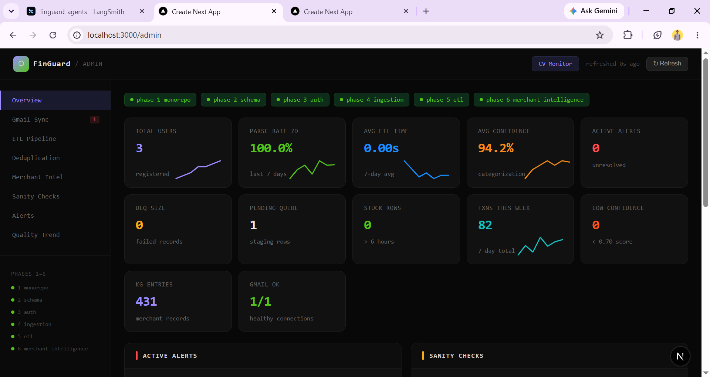
  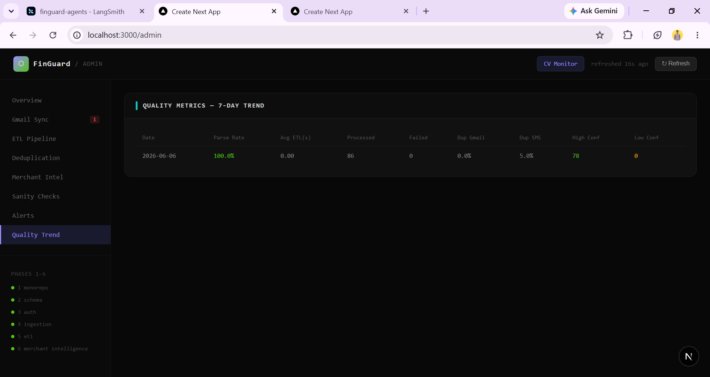
  <br/><sub>Ops overview — parse rate, KG entries, Gmail health · 7-day quality metrics</sub>
</p>

<p align="center">
  
  
  <br/><sub>MLflow run detail — BERT and LSTM metric charts</sub>
</p>

### Mobile App

```env
# frontend/mobile/.env
EXPO_PUBLIC_SUPABASE_URL=https://YOUR_PROJECT.supabase.co
EXPO_PUBLIC_SUPABASE_ANON_KEY=eyJ...
EXPO_PUBLIC_API_URL=http://192.168.x.x:8000   # LAN IP, not localhost
```

| Profile | Command | Use |
|---|---|---|
| `development` | `npx eas build --platform android --profile development` | Dev client + native SMS |
| `preview` | `npx eas build --platform android --profile preview` | Internal APK |

### End-to-End Debug Queries

```sql
-- Staging row
SELECT id, source, status, left(raw_text, 80), created_at
FROM ingestion_staging WHERE user_id = 'UUID' ORDER BY created_at DESC LIMIT 5;

-- Transaction created
SELECT id, amount_paisa, merchant_name, category, account_id, transaction_date
FROM transactions WHERE user_id = 'UUID' ORDER BY created_at DESC LIMIT 5;

-- Wallet balance
SELECT id, provider_slug, balance_state, current_balance_paisa, manually_verified_at
FROM accounts WHERE user_id = 'UUID';
```

Force ETL manually: `POST /api/v1/etl/process-pending` with user JWT.

---

## Document Map

| File | Purpose |
|---|---|
| `README.md` | Full system reference — start here |
| `deployment.md` | Production deploy & troubleshooting |
| `backend/API_REFERENCE.md` | Every HTTP route |
| `evidence/README.md` | Pre-deploy benchmark artifacts |
| `evidence/MLFLOW_METRICS.md` | BERT / LSTM / Fraud / RAG numbers |

---

<div align="center">

**FinGuard AI — June 2026**

Built with FastAPI · Celery · Supabase · Expo · LangGraph · BERT · LSTM · RAG

*Developed by [Muhammad Faran](https://github.com/muhammadfaran) — AI/ML Engineer &  [Muhammad Hassan Shahbaz](https://github.com/hassan7272) — AI/ML Engineer*

</div># Pakistan-First-Automated-Personal-Finance-Platfrom
